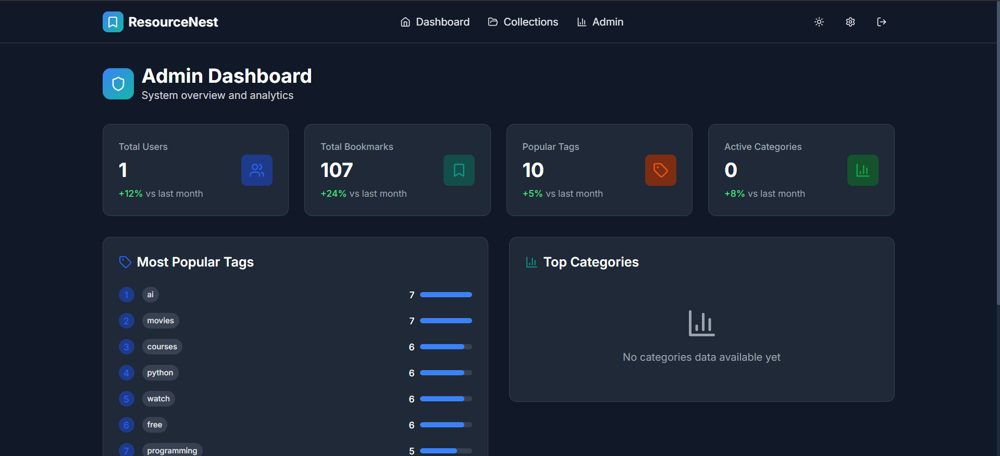
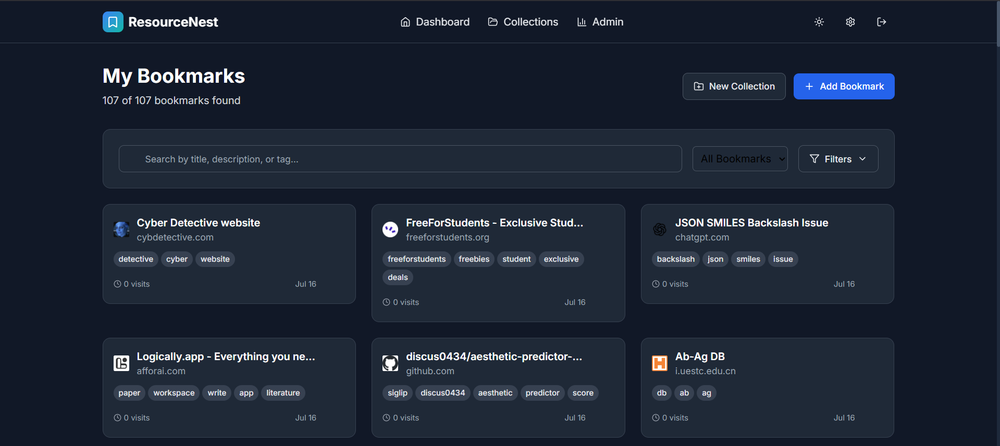
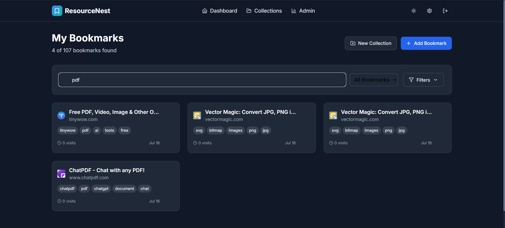
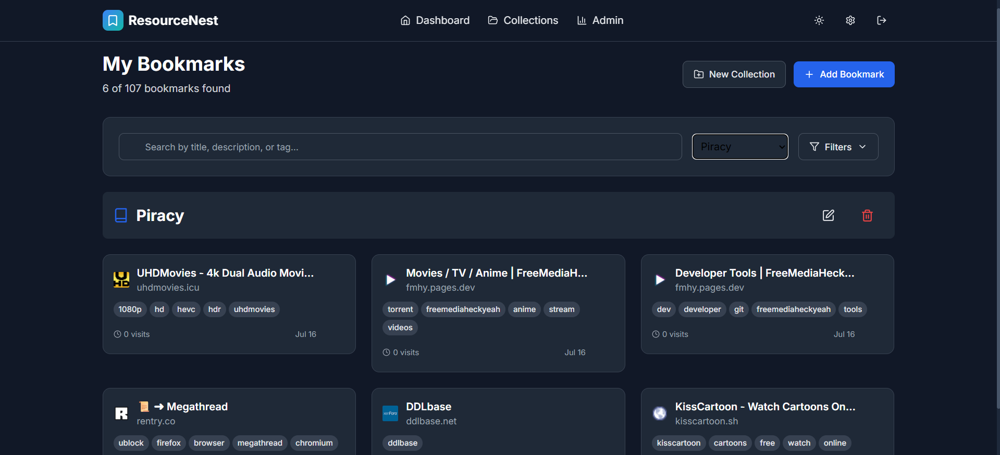
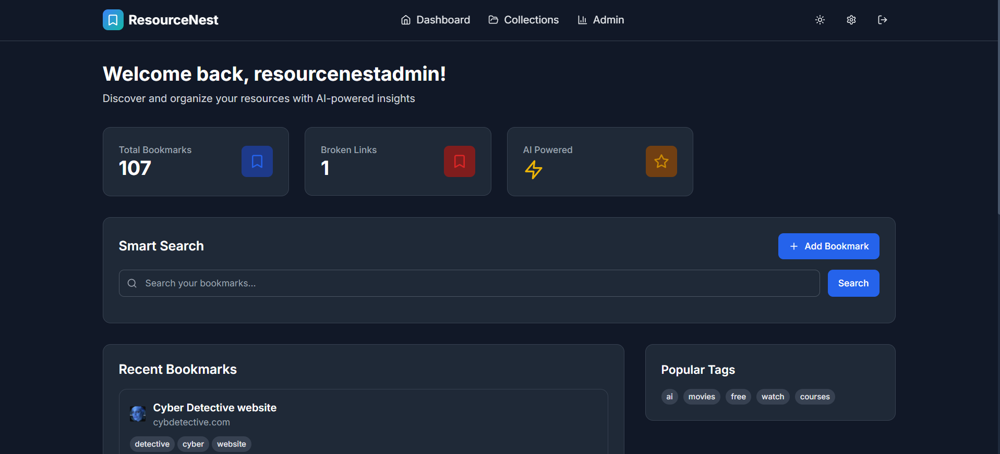
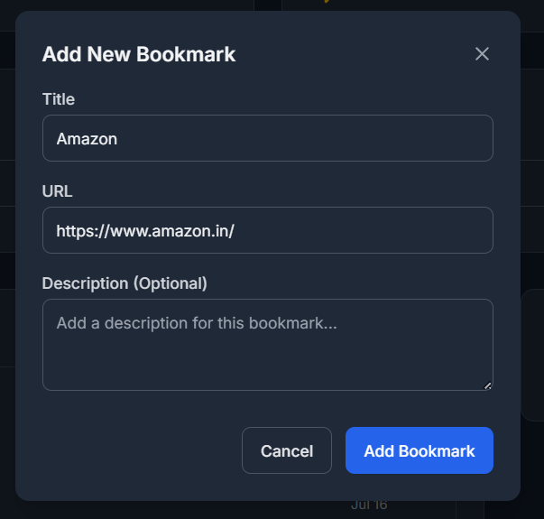

ResourceNest


A modern, smart bookmark manager powered by AI — helping you organize, search, and manage your resources effectively with beautiful UI, AI-generated metadata, and smart features.

---

## 🚀 Live Demo

* **Frontend**: [https://resource-nest.vercel.app](https://resource-nest.vercel.app)
* **Backend**: [https://resourcenest.onrender.com](https://resourcenest.onrender.com)

---

## ✨ Features

* **AI-Powered Organization**: Automatically scrapes titles, descriptions, and generates relevant tags for your bookmarks.
* **Semantic Search**: Find bookmarks by describing what you're looking for, powered by sentence embeddings and cosine similarity.
* **Collections**: Group your bookmarks into logical collections for better organization and project management.
* **Link Health Monitoring**: Automatically checks for broken or dead links to keep your collection clean and up-to-date.
* **Import & Export**: Seamlessly import your existing bookmarks from browser exports (HTML), JSON, or CSV files.
* **Secure Sharing**: Create shareable links for individual bookmarks or entire collections.
* **User Authentication**: Secure user registration and login system using JWT.
* **Admin Dashboard**: An analytics panel for administrators to monitor system-wide statistics like total users, bookmarks, and popular tags.
* **Modern UI**: A responsive and intuitive interface built with React, TypeScript, and Tailwind CSS, featuring a dark mode.

---

## 🛠️ Tech Stack

### Backend

* **Framework**: FastAPI
* **Database**: MongoDB Atlas
* **Authentication**: JWT
* **ML/AI**:

  * `sentence-transformers/paraphrase-MiniLM-L3-v2` for semantic embedding
  * `keybert` for keyword/tag generation
* **Web Scraping**: BeautifulSoup, Requests
* **Hosting**: Render

### Frontend

* **Framework**: React + Vite
* **Language**: TypeScript
* **Styling**: Tailwind CSS
* **State Management**: Context API
* **Routing**: React Router
* **UI Components**: `lucide-react`, custom components
* **Animations**: Framer Motion
* **Hosting**: Vercel

---

## 📂 Project Structure

### Frontend

```
frontend/
├── src/
│   ├── components/            # Reusable UI components
│   │   ├── bookmarks/
│   │   │   ├── BookmarkCard.tsx
│   │   │   └── BookmarkForm.tsx
│   │   ├── layout/
│   │   │   └── Navbar.tsx
│   │   └── UI/
│   │       ├── Button.tsx
|   |       ├── Badge.tsx
|   |       ├── Card.tsx
|   |       ├── Input.tsx
│   │       └── Modal.tsx
│   ├── context/               # Theme and Auth Context Providers
│   │   ├── ThemeContext.tsx
│   │   └── AuthContext.tsx
│   ├── pages/                 # Route pages
│   │   ├── AdminPanel.tsx
│   │   ├── Collections.tsx
│   │   ├── Dashboard.tsx
│   │   ├── LandingPage.tsx
│   │   ├── Settings.tsx
│   │   └── SharedBookmarks.tsx
│   ├── services/              # API services
│   │   └── api.ts
│   ├── types/
│   │   └── index.ts    
│   ├── App.tsx
│   ├── main.tsx
│   └── index.css
└── config files
```

### Backend

```
backend/
├── main.py
├── models.py
├── utils.py
├── db.py
├── routes/
│   ├── admin.py
│   ├── analytics.py
│   ├── auth.py
│   ├── bookmarks.py
│   ├── collection.py
│   └── import_bookmarks.py
├── ml/
│   ├── embedding.py
│   ├── tags.py
│   └── scraper.py
├── requirements.txt
└── .env.example
```

---

## ⚙️ Getting Started

### Backend Setup

```bash
git clone https://github.com/rushikatabathuni/ResourceNest.git
cd ResourceNest/backend

python -m venv venv
source venv/bin/activate  # On Windows use venv\Scripts\activate

pip install -r requirements.txt

cp .env.example .env
# Fill in MongoDB and JWT secret in backend's.env
# Fill in VITE_API_URL in frontend's.env [backend link]
#In backend/main.py, add your url to cors origin
uvicorn main:app --reload
```

### Frontend Setup

```bash
cd ../frontend
npm install
cp .env.example .env
# VITE_API_URL=http://localhost:8000
npm run dev
```

---

## 🧠 Models Used

* `sentence-transformers/paraphrase-MiniLM-L3-v2`: Embedding generation
* `keybert`: Tag generation
* `BeautifulSoup`: Metadata scraping

---

## 🔐 API Endpoints

* `POST /register`
* `POST /login`
* `POST /admin/login`
* `GET /bookmarks/`
* `POST /bookmarks/add`
* `PUT /bookmarks/edit/{id}`
* `DELETE /bookmarks/delete/{id}`
* `POST /search`
* `POST /bookmarks/import`
* `POST /bookmarks/share`
* `GET /shared/{share_id}`
* `GET /collections/`
* `POST /collections/`
* `DELETE /collections/{id}`
* `GET /admin/analytics`

---

##  Future Roadmap

*  Browser Extension
*  Tag Merging and Tag Suggestions
*  Browser Sync
*  Collaborative Collections
  
---

##  Contribution

Open to issues and PRs. Star ⭐ the repo if you find it useful!

---

##  Author

[Rushi Katabathuni](https://github.com/rushikatabathuni)
[LinkedIn](https://www.linkedin.com/in/rushikatabathuni/)

---
ScreenShots:








